# DNA Codemap

> Agent-navigable architecture map for the DNA (Design Nexus Architecture) monorepo.\
> Turborepo + pnpm workspaces. All diagrams render in GitHub, VS Code (with extension), and Obsidian.

***

## 1. Monorepo Workspace Graph

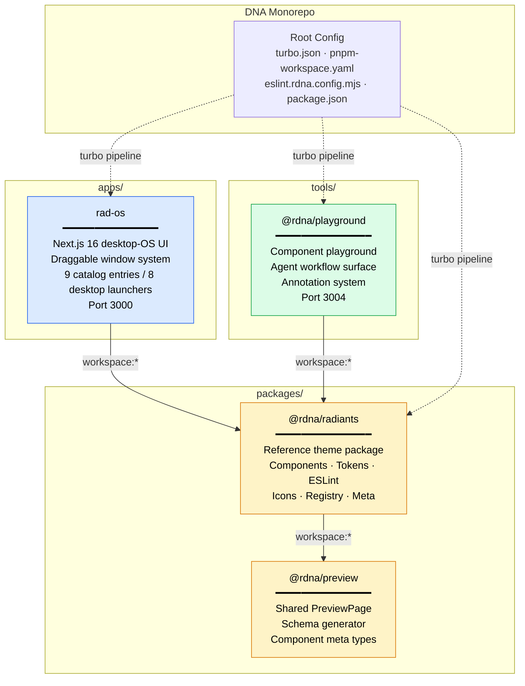

***

## 2. Package: `@rdna/radiants` — Theme System

**Path:** `packages/radiants/`

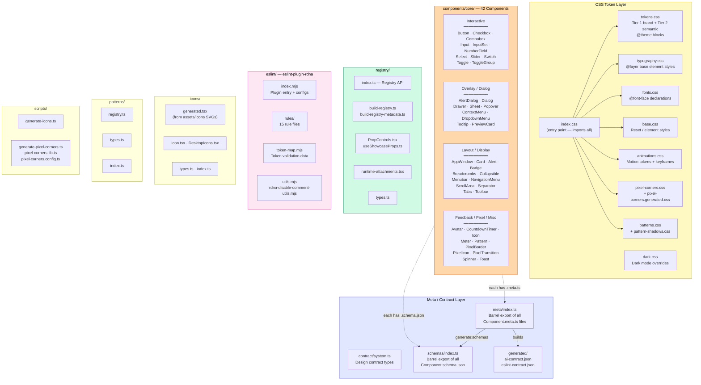

### Component File Convention (per component)

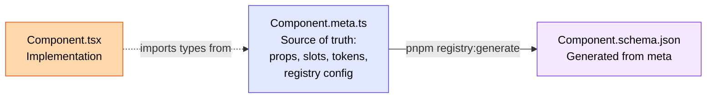

### Exports Map (`package.json`)

| Export Path                    | Entry Point                  | Type                                 |
| ------------------------------ | ---------------------------- | ------------------------------------ |
| `.`                            | `index.css`                  | Full theme CSS                       |
| `./tokens`                     | `tokens.css`                 | Token-only CSS                       |
| `./dark`                       | `dark.css`                   | Dark mode overrides                  |
| `./animations`                 | `animations.css`             | Motion CSS                           |
| `./base`                       | `base.css`                   | Base reset CSS                       |
| `./typography`                 | `typography.css`             | Typography styles                    |
| `./fonts`                      | `fonts.css`                  | Font declarations                    |
| `./components/core`            | `components/core/index.ts`   | All component exports                |
| `./icons`                      | `icons/index.ts`             | 154 icon components + dynamic loader |
| `./schemas`                    | `schemas/index.ts`           | Generated schema barrel              |
| `./eslint`                     | `eslint/index.mjs`           | ESLint plugin                        |
| `./registry`                   | `registry/index.ts`          | Component registry + types           |
| `./meta`                       | `meta/index.ts`              | Component meta index                 |
| `./patterns`                   | `patterns/index.ts`          | 51 dither patterns (6 groups)        |
| `./registry/forced-states.css` | `registry/forced-states.css` | Pseudo-state CSS                     |

### All 42 Components

| Directory         | Component       | Has Tests | Base-UI Wrap |
| ----------------- | --------------- | --------- | ------------ |
| `Alert/`          | Alert           | yes       | -            |
| `AlertDialog/`    | AlertDialog     | yes       | yes          |
| `AppWindow/`      | AppWindow       | yes       | yes          |
| `Avatar/`         | Avatar          | yes       | yes          |
| `Badge/`          | Badge           | yes       | -            |
| `Breadcrumbs/`    | Breadcrumbs     | -         | -            |
| `Button/`         | Button          | yes       | yes          |
| `Card/`           | Card            | yes       | -            |
| `Checkbox/`       | Checkbox, Radio | yes       | yes          |
| `Collapsible/`    | Collapsible     | yes       | yes          |
| `Combobox/`       | Combobox        | yes       | yes          |
| `ContextMenu/`    | ContextMenu     | yes       | yes          |
| `CountdownTimer/` | CountdownTimer  | yes       | -            |
| `Dialog/`         | Dialog          | yes       | yes          |
| `Drawer/`         | Drawer          | yes       | yes          |
| `DropdownMenu/`   | DropdownMenu    | yes       | yes          |
| `Icon/`           | Icon            | -         | -            |
| `Input/`          | Input, TextArea | yes       | yes          |
| `InputSet/`       | InputSet        | yes       | yes          |
| `Menubar/`        | Menubar         | yes       | yes          |
| `Meter/`          | Meter           | yes       | yes          |
| `NavigationMenu/` | NavigationMenu  | yes       | yes          |
| `NumberField/`    | NumberField     | yes       | yes          |
| `Pattern/`        | Pattern         | yes       | -            |
| `PixelBorder/`    | PixelBorder     | yes       | -            |
| `PixelIcon/`      | PixelIcon       | yes       | -            |
| `PixelTransition/` | PixelTransition | yes       | -            |
| `Popover/`        | Popover         | yes       | yes          |
| `PreviewCard/`    | PreviewCard     | yes       | yes          |
| `ScrollArea/`     | ScrollArea      | yes       | -            |
| `Select/`         | Select          | yes       | yes          |
| `Separator/`      | Separator       | -         | yes          |
| `Sheet/`          | Sheet           | yes       | yes          |
| `Slider/`         | Slider          | yes       | yes          |
| `Spinner/`        | Spinner         | -         | -            |
| `Switch/`         | Switch          | yes       | yes          |
| `Tabs/`           | Tabs            | yes       | yes          |
| `Toast/`          | Toast           | yes       | yes          |
| `Toggle/`         | Toggle          | yes       | yes          |
| `ToggleGroup/`    | ToggleGroup     | yes       | yes          |
| `Toolbar/`        | Toolbar         | yes       | yes          |
| `Tooltip/`        | Tooltip         | yes       | yes          |

***

## 3. App: `rad-os` — Desktop OS UI

**Path:** `apps/rad-os/` · **Port:** 3000

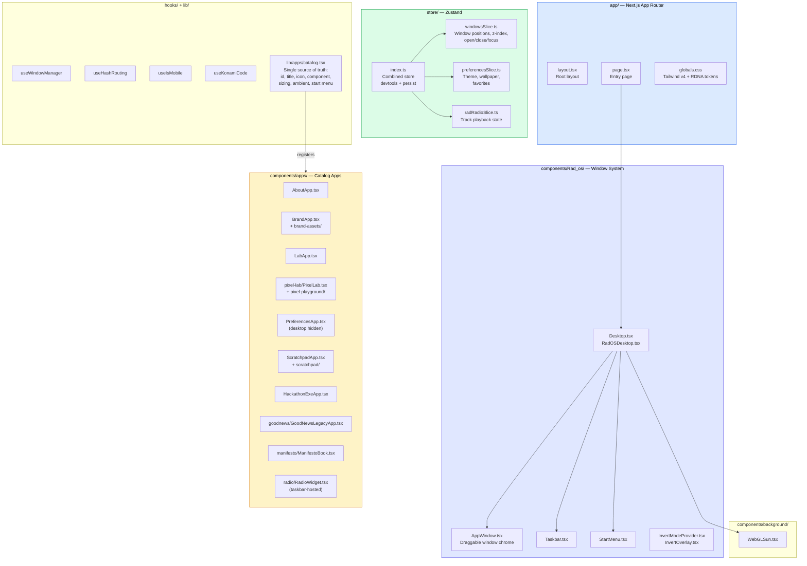

### App Catalog (`lib/apps/catalog.tsx`)

| id | Window Title | Category | Desktop Visible | Subtabs |
| --- | --- | --- | --- | --- |
| `brand` | Brand | tools | yes | Logos, Color, Type |
| `lab` | Dev Tools | tools | yes | UI Library |
| `pixel-lab` | Pixel Lab | tools | yes | Radiants, Corners, Icons, Patterns, Dither, Canvas |
| `preferences` | Preferences | tools | no | General, Themes |
| `scratchpad` | Scratchpad | tools | yes | - |
| `hackathon-exe` | Hackathon.EXE | media | yes | Winners, Submissions, Archive |
| `good-news` | Good News | media | yes | - |
| `about` | About | about | yes | - |
| `manifesto` | Becoming Substance | about | yes | - |

Radio playback is taskbar-hosted through `components/apps/radio/RadioWidget.tsx`, not registered as a launchable catalog window.

### Zustand Store Persistence

Key: `rados-storage` (v1). Persists: `volume`, `reduceMotion`, `darkMode`, `radioFavorites`. Does NOT persist window positions or invertMode.

***

## 4. Tool: `@rdna/playground` — Component Playground

**Path:** `tools/playground/` · **Port:** 3004

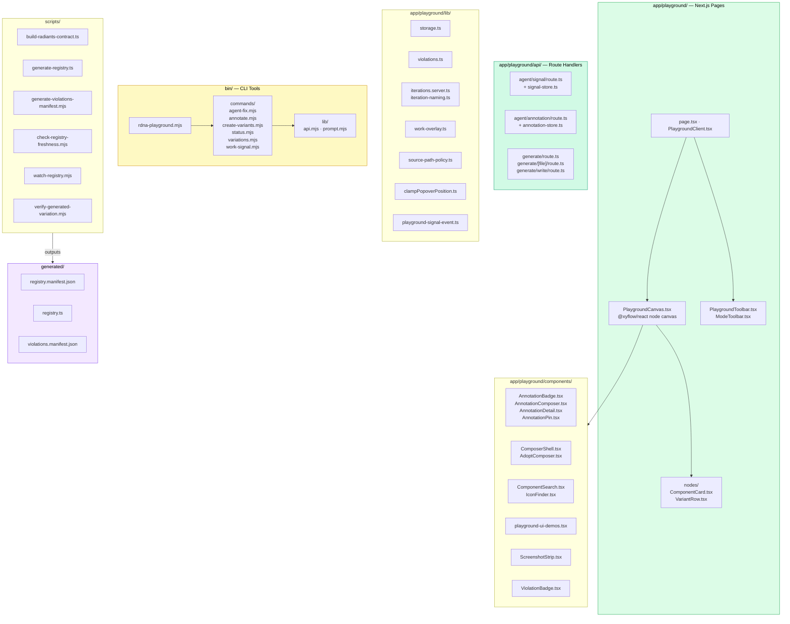

***

## 5. Data Flow: Registry Pipeline

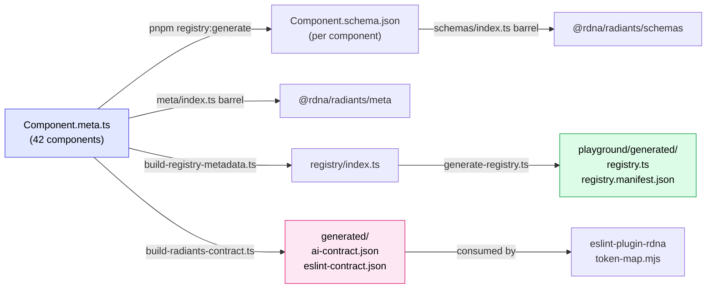

***

## 6. Data Flow: Token System

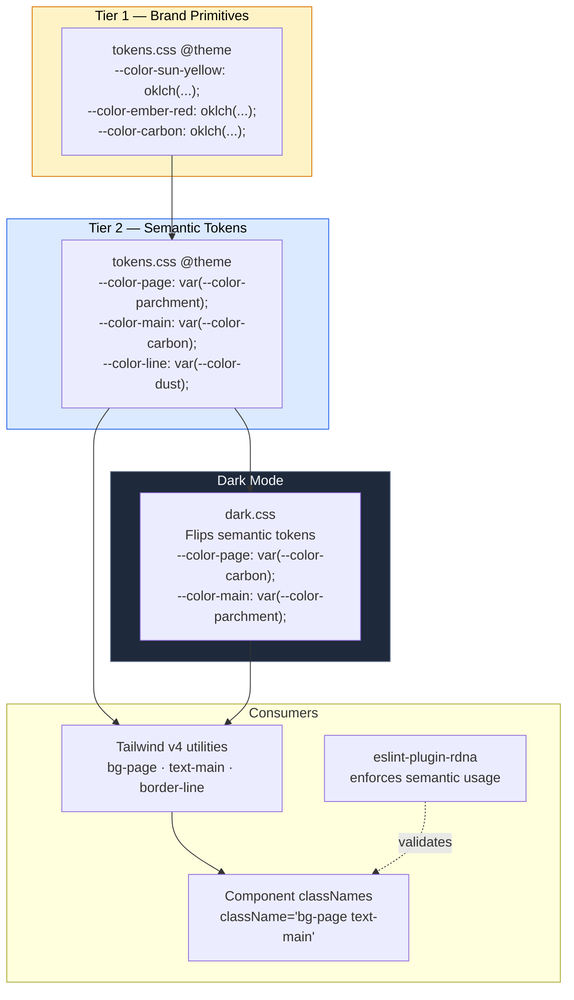

***

## 7. Data Flow: Agent Workflow (Playground)

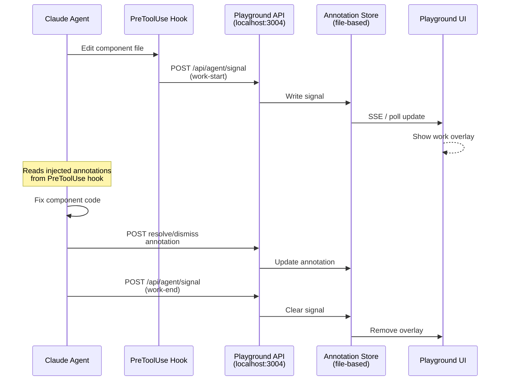

***

## 8. ESLint Plugin Architecture

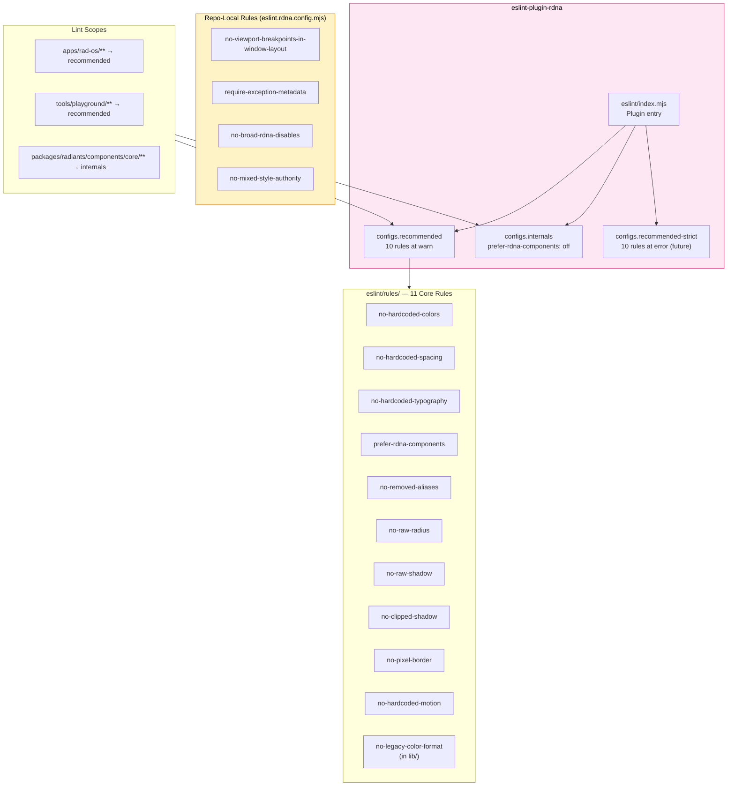

***

## 9. Root Scripts & Infrastructure

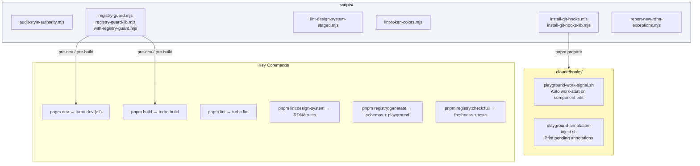

***

## 10. Documentation & Research Map

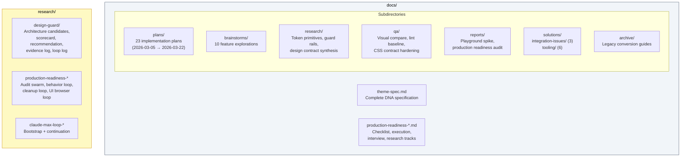

***

## 11. Quick File Finder

### Where is...?

| Looking for                    | Path                                                            |
| ------------------------------ | --------------------------------------------------------------- |
| **Design tokens**              | `packages/radiants/tokens.css`                                  |
| **Dark mode overrides**        | `packages/radiants/dark.css`                                    |
| **Typography styles**          | `packages/radiants/typography.css`                              |
| **Font declarations**          | `packages/radiants/fonts.css`                                   |
| **Animation tokens**           | `packages/radiants/animations.css`                              |
| **Pixel corner CSS**           | `packages/radiants/pixel-corners.css` + `.generated.css`        |
| **A specific component**       | `packages/radiants/components/core/{Name}/{Name}.tsx`           |
| **Component metadata**         | `packages/radiants/components/core/{Name}/{Name}.meta.ts`       |
| **Component schema**           | `packages/radiants/components/core/{Name}/{Name}.schema.json`   |
| **All component exports**      | `packages/radiants/components/core/index.ts`                    |
| **All meta exports**           | `packages/radiants/meta/index.ts`                               |
| **Icon components**            | `packages/radiants/icons/generated.tsx`                         |
| **Icon source SVGs**           | `packages/radiants/assets/icons/`                               |
| **ESLint plugin entry**        | `packages/radiants/eslint/index.mjs`                            |
| **ESLint rule impl**           | `packages/radiants/eslint/rules/{rule-name}.mjs`                |
| **ESLint token map**           | `packages/radiants/eslint/token-map.mjs`                        |
| **Registry API**               | `packages/radiants/registry/index.ts`                           |
| **AI contract (generated)**    | `packages/radiants/generated/ai-contract.json`                  |
| **Design contract types**      | `packages/radiants/contract/system.ts`                          |
| **Pattern definitions**        | `packages/radiants/patterns/registry.ts`                        |
| **rad-os entry**               | `apps/rad-os/app/page.tsx`                                      |
| **rad-os globals CSS**         | `apps/rad-os/app/globals.css`                                   |
| **App catalog**                | `apps/rad-os/lib/apps/catalog.tsx`                              |
| **Window system**              | `apps/rad-os/components/Rad_os/`                                |
| **Zustand store**              | `apps/rad-os/store/index.ts`                                    |
| **Store slices**               | `apps/rad-os/store/slices/{name}Slice.ts`                       |
| **Playground page**            | `tools/playground/app/playground/page.tsx`                      |
| **Playground CLI**             | `tools/playground/bin/rdna-playground.mjs`                      |
| **Playground registry**        | `tools/playground/generated/registry.ts`                        |
| **Playground annotations API** | `tools/playground/app/playground/api/agent/annotation/route.ts` |
| **Playground signals API**     | `tools/playground/app/playground/api/agent/signal/route.ts`     |
| **Schema generator**           | `packages/preview/src/generate-schemas.ts`                      |
| **PreviewPage component**      | `packages/preview/src/PreviewPage.tsx`                          |
| **RDNA lint config**           | `eslint.rdna.config.mjs` (root)                                 |
| **Registry guard**             | `scripts/registry-guard.mjs`                                    |
| **Design spec**                | `docs/theme-spec.md`                                            |
| **Design system doc**          | `packages/radiants/DESIGN.md`                                   |
| **Plans archive**              | `archive/plans/`                                                |
| **Research artifacts**         | `archive/research/design-guard/`                                |
| **Iteration files**            | `tools/playground/app/playground/iterations/`                   |
| **Iteration prompt builder**   | `tools/playground/app/playground/prompts/iteration.prompt.ts`   |
| **Annotation store**           | `tools/playground/app/playground/api/agent/annotation-store.ts` |
| **Signal store**               | `tools/playground/app/playground/api/agent/signal-store.ts`     |
| **Window sizing**              | `apps/rad-os/lib/windowSizing.ts`                               |
| **Konami code easter egg**     | `apps/rad-os/hooks/useKonamiCode.ts`                            |
| **WebGL background**           | `apps/rad-os/components/background/WebGLSun.tsx`                |
| **Preview package types**      | `packages/preview/src/types.ts`                                 |
| **Define component meta**      | `packages/preview/src/define-component-meta.ts`                 |
| **Prompt templates**           | `archive/prompts/dna-conversion/templates/`                     |
| **Production readiness**       | `docs/production-readiness-checklist.md`                        |

### Ports

| Service    | Port | Command    |
| ---------- | ---- | ---------- |
| rad-os     | 3000 | `pnpm dev` |
| playground | 3004 | `pnpm dev` |

### Key Dependencies

| Dep                        | Used By              | Purpose             |
| -------------------------- | -------------------- | ------------------- |
| `@base-ui/react` ^1.4.1    | radiants, ctrl       | Headless primitives |
| `class-variance-authority` | radiants, playground | Variant styling     |
| `zustand` ^5               | rad-os               | State management    |
| `react-draggable`          | rad-os               | Window dragging     |
| `@xyflow/react`            | playground           | Node canvas         |
| `next` 16.1.6              | rad-os, playground   | Framework           |
| `tailwindcss` ^4           | all                  | CSS engine          |
| `vitest`                   | all                  | Testing             |

⠀
